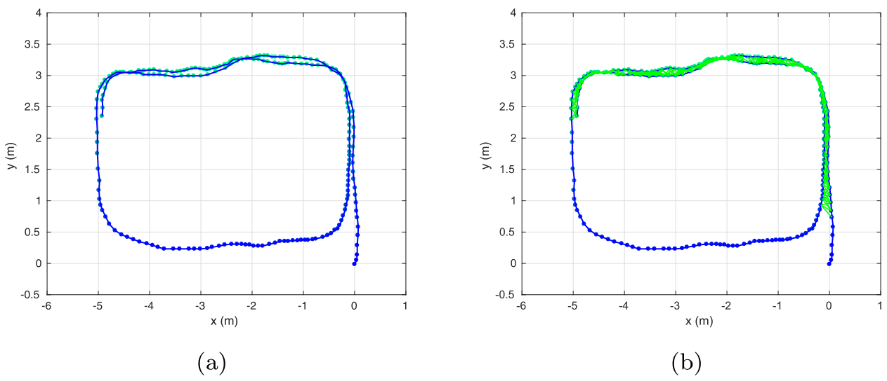

>多物体场景中基于图结构匹配的语义闭环检测
>Qin C, Zhang Y, Liu Y, et al. [Semantic loop closure detection based on graph matching in multi-objects scenes](https://www.semanticscholar.org/paper/Semantic-loop-closure-detection-based-on-graph-in-Qin-Zhang/c75925104e3c09370db174a0d5e54477d777e37b)[J]. Journal of Visual Communication and Image Representation, 2021, 76: 103072.
>
>东北大学 信息科学与工程学院 [学院主页](http://www.ise.neu.edu.cn/)

## 【Thinking】论文四问

- 1. **针对什么问题？**
  - 基于特征描述的闭环检测方法，收到视点、照明、季节、天气以及新增动静态物体的影响，需要寻找利用语义信息进行更鲁棒定位的方法。
- 2. **采用什么方法？**
  - ① 一种基于**包围框深度信息**和**物体检测语义标签**的语义子图**拓扑表示方法**。
  - 
- 3. **达到什么效果？**
  - 
  - 物理实验中与Conv3、DBoW3、**NetVLAD**、DeepLCD、Landmarks、LoST-X、**LND**方法进行了对比。
- 4. **存在什么不足？**
  - 

## 0. 摘要

​		鲁棒的闭环检测对于视觉SLAM很重要，传统方法关注几何和视觉特征，忽略物体语义信息。本文提供了提出**一种只保留语义和几何信息用于检测的策略，将视觉场景建模为语义子图结构**。为了更高效地匹配子图，使用**稀疏 Kuhn–Munkres 公式**加速节点一致性搜索，3D空间中物体间的**形状相似度**和**欧拉距离**在图结构匹配中被用来衡量图片相似度。进一步，提出的方法在几个数据集和两个室内真实场景中与最新算法进行了分析和比较，结果标明，不提取视觉特征的基于语义图结构的表示有可靠的、有竞争力的精度，对于回环检测来说是可行的。

---

## 1. Introduction

​		闭环检测（LCD）或视觉地点识别（VPR）用于匹配重复访问地点的匹配，对于SLAM系统来说非常重要，但其因为视点、时间、季节和照明变化带来的视觉外观变化而变得具有挑战。

​		**闭环检测的关键在于如何对抗各种感知变化描述一个特殊地点**，将图像表示为向量或矩阵计算相似度是一种方便有效的方法，有两类：**① 构建图像整体描述符**，如Gist [5], color histogram [6], and HOG [7]，一些特征已经被地点识别中 [8,9]，基于卷积神经网络的方法 [10-12] 也展现出巨大潜力，这些方法还是会**受到视点变化影响**；**② 提取局部描述符**，如：SIFT [13] and SURF [14]，然后将其统计为词袋（BoW） [15,16]，可以高效压缩、编码图像信息，但是**会受到照明、季节、天气变化和新的静态/动态物体影响**，语义信息有潜力实现更鲁棒的定位。

​		只使用颜色的LCD方法已经一定应对环境、视点变化的能力，其他的信息（如深度）有潜力提升性能。例如：① **深度信息提升语义重建** [17] 和 **相反视角下的视觉地点识别** [18,19] 效果，② 已经有**一些工作 [22-24]** 探索高层次视觉特征提供的更鲁棒的场景表示，利用了**物体的分类和相互关系**，③ 论文 [25] 和 X-View [26] **使用稠密语义、语义图结构和拓扑关联**对环境进行建模，能够在极端的外观变化下进行全局定位。

​		受到这些发现驱动，本文提出**一种基于物体的、使用语义子图匹配的、多物体环境中的LCD方法**，仿照人类感知方式获得物体信息而非视觉外观信息，语义、几何信息结合构建每帧语义子图结构，采用稀疏 Kuhn–Munkres (KM) [27] 算法**匹配子图**、估计变换矩阵，在图匹配中基于**对节点、边的差异的度量**构建评分函数、估计图像相似度，Fig.1说明了算法整体框架，本文工作主要贡献如下：

- 1） 一个**语义子图的拓扑表示模型**，只利用了包围框深度信息和物体检测语义标签。
- 2） 一种**基于图匹配的图像相似度度量方法**，使用系数KM算法高效匹配子图中的节点。
- 3） 在几个公开数据集和2个真实场景中**进行的实验**，展示了所提方法具备竞争力的结果。

    Fig.1.方法整体框架。输入RGB图像和深度图像，首先使用YOLO9000 [1] 检测物体，深度图像使用In-paints操作 [2] 预处理，使用包围框的深度信息和语义信息构建语义子图 G ，系统将当前图像的子图与全局图结构中的先前图像匹配，生成回环。

## 2. Related Work

### 2.1 基于外观的方法

- 外观方法的早期成功应用 [28,29]
- 1）**使用BoW模型**，创建分类视觉特征**词典**，**图像被表示为词语出现直方图或频率**，比较其相似度判断是否为重复访问地点，著名方法有基于SURF特征的 FAB-Map [20] 和基于ORB特征 [31] 的 ORB-SLAM [30]，可以通过很多方法吸收额外信息加以改进，包括局部聚合描述符向量VLAD [32]、空间验证 [33] 和 加速描述符 [15]。**优点**：效率高；**缺点**：收到图像条件变化影响，需要预先建立词典。
- 2）**使用CNN特征** [11,22,34-36]。**Hou在 [34]** 中使用 AlexNet [35] 模型提取特征 ，在明显的**照明变化**中展现鲁棒性；**Sunderhauf在 [22]** 中使用CNN提取图像区域特征描述符，验证了对于**视点变化的处理**，局部描述符相比全局描述符更高效。更多最近的工作包括 **NetVLAD [36]** ，一个将传统 VLAD [32] 结构集成到CNN中的神经网络架构，实现了视觉地点识别的**端到端训练**。**无监督卷积自动编码器网络 DeepLCD [11]** 也因其压缩能力和鲁棒性被应用在视觉SLAM中。**优点**：这些方法大多数被证明能够处理LCD问题、在许多实际项目中取得可接受的稳定性，**缺点**：由于CNN特征的高维性和冗余性，图像匹配效率降低。

### 2.2 基于语义和物体的方法

​		语义建图 [37] 指的是建图过程中不仅获取环境几何信息，还获取语义信息（如分类和属性）。第一个**结合语义信息和稀疏表示方法**的系统在 [38] 中被提出。多层地图为机器人构建出来，包括度量地图、拓扑地图、语义概念和关系。还有很多其他**将提取语义和几何信息的过程独立开**的方法 [39,40]。**SLAM++ [41]** 首先**构建物体系统**并**联合物体检测和RGB-D SLAM**实现位姿图优化，与这一方法不同，我们的方法无需先验模型库。

​		深度学习的最新技术能够分析环境获得更加丰富的语义信息，如物体分类、像素级标签。**Fusion++ [42]** 提出了一个**在线物体级SLAM系统**，从基于图像的实例分割、TSDF融合和跟踪模块构建。Mousavian 在 [43] 中提出了一种**使用语义分割**以仅从建筑物算去特征点以改进BoW模型的方法。Tayyab 在 [44] 中提出了一种学习稳定图像区域的方法，应对挑战性的感知条件，展示出**语义显著区域提取的特征改进了CNN提取的特征描述符**。Ross 在 [24] 中展示了一个**基于物体图结构的地点识别系统**，同时构建了一个稠密RGB-D地图。类似地，Yu在 [25] 中展示了一种使用**稠密语义、3D拓扑和语义级匹配**估计6自由度相机位姿的**全局定位方法**。Bowman在 [45] 中构建了一个包含语义物体检测的语义地图，同时关注了语义定位的数据关联问题。QuadricSLAM [46] 使用多视点2D检测结果构建二次曲面表示，同时估计最佳相机位姿。这一工作提供了**物体位置、朝向和形状的完整表示**，但是这一表示在回环检测中没有被利用起来。Johannes在 [47] 中采用了一个针对3D语义描述符学习的通用模型，**3D几何和语义信息**被使其成功在极端的条件变化下成功定位。[48] 中提出了一个新颖的视觉语义里程计（VSO）框架，很容易集成已有VO系统中。VSO使用物体语义信息的不变性获得中期内的连续点跟踪。对比 [48] 中专注于使用数据关联减小漂移的研究，我们的方法旨在**通过一个基于图结构的、融合深度信息的语义表示模型解决回环闭合问题**。

### 2.3 基于图结构的方法

​		现在，**拓扑方法处理全局定位**在此获得了研究者们的关注，主要是因为拓扑结构能够**高效编码图像中视觉特征和物体的关系** [23,24,49]，将环境建模为一个图结构**需要定义节点和边**，一个常见的方法是融合语义信息到图像中形成子图模型，为了处理闭环检测中视点和外观变化的问题，Cascianelli等人在 [50] 中从预先训练的CNN中提取**“半语义”特征**，在探索过程中建立**一个增量式的、基于共视性图结构的模型**，但它只使用了CNN提供的视觉特征而没有其他高层次语义属性。在 [51] 中提出了一个新颖的混合了度量、拓扑和语义的地图结构，这样的结构依赖于图像语义区域的形状属性，并且一帧帧地建立图像子图。Stumm等人在 [49] 中提出使用图内核（graph kernels）进行视觉地点识别。它验证了**集成到视觉结构信息的基于图结构的描述符能够提升定位性能**。

​		一个相关但是不同的工作 [26] 建立了一个多视点全局定位系统。这一方法使用语义分割的结果和逐帧的图结构实现全局定位估计，但是它完全依赖语义标签而没有使用几何线索。受到这些先前工作的驱动，我们想要**将语义和几何信息集成到图结构表示**中，并且进一步地**使用图结构匹配实现语义子图之间的相似度计算**，而非使用图结构比较技术。

---

## 3. 方法

### 3.1 语义信息提取

​		[26,48] 中使用了像素级分割，对于本文来说是冗余的，本文选择了物体标签信息检测，方法之一是基于提议的物体检测（以检测框形式生成多个物体提案，每个都分类标签并生成独立分布），由R-CNN [52] 所引领，充分发展出 Fast-RCNN [53] 和 YOLO9000 [1]。**YOLO9000包含9000个物体类别**，且**检测速度可以能达到60FPS**，因此选取它作为本文物体检测器。在闭环检测中，**重要的检测标签的一致性**而非准确性。

### 3.2 子图表示

​		将图像中检测到的每个物体表示为一个三元组：
$$
o_i=(c_i,r_i,\sigma_i)
$$
其中 $c_i$ 是物体分类标签，$r_i=(x_1,y_1,x_2.y_2)$ 表示物体 $o_i$ 的包围框（坐上点和右下点的像素坐标系坐标），$\sigma_i\in(0,1]$ 表示物体置信度。每张图像可以表示为：
$$
O=\{o_i=(c_i,r_i,\sigma_i)\vert c_i\in C,i=1,2,...,k\}
$$
​		其中 $C$ 为所有类别标签，$k$ 表示图像包围框数量。

​		由此建立每帧的子图 $\mathcal{G}=(\mathcal{V}, \mathcal{E})$，$\mathcal{V}$ 为节点集合，基于物体检测结果获得，$\mathcal{E}$ 为边集合，**所有节点直接建立无向边**，**两物体在世界坐标系的距离**表示子图中**边的特征**，定义物体检测框的几何中点 $P_{uv}=(u_{o_{i}},v_{o_{i}})$ 。
$$
u_{o_{i}}=\frac{1}{2}(x_{i1},x_{i2}),v_{o_{i}}=\frac{1}{2}(y_{i1},y_{i2})
$$
​		从深度图像中获得中点深度 $d(u_{o_{i}},v_{o_{i}})$ ，并计算出该像素点的是相机坐标系坐标 $P_c=(X_c,Y_c,Z_c)$：
$$
\left\{\begin{array}{l}
Z_{c}=d\left(u_{o_{i}}, v_{o_{i}}\right) \\
X_{c}=\frac{\left(u_{o_{i}}-c_{x}\right) \cdot Z_{c}}{f_{x}} \\
Y_{c}=\frac{\left(v_{o_{i}}-c_{y}\right) \cdot Z_{c}}{f_{y}}
\end{array}\right.
$$
​		其中 $f_x,f_y,c_x,c_y$ 是相机内参，$P_w=(X,Y,Z)$ 表示对应3D点的世界坐标系坐标，使用 公式 (5) 计算得到，其中 $R_{wc}$ 和 $t_{wc}$ 分别表示**世界坐标系**相对于**相机坐标系**的旋转矩阵和平移量。
$$
P_w=R_{wc}\cdot P_c+t_{wc}
$$
​		物体 $o_i$ 与 $o_j$ 之间在3D空间相对距离使用欧拉距离计算如下：
$$
d_{ij}=\sqrt{(X_i-X_j)^2+(Y_i-Y_j)^2+(Z_i-Z_j)^2}
$$
​		物体间的相对距离不会改变，几何信息具有视点不变性。

### 3.3 基于图结构匹配的相似度测量

​		子图匹配的目的在于找到当前图像与历史图像的高相似度。

#### 3.3.1 子图匹配

​		对于当前图像 $I_q$ 和先前图像 $I_p$ ，可以使用 3.2节 中的方法建立子图表示 $Q$ 和 $P$。语义子图的对齐是一个初始步骤，需要先对子图中的节点进行关联，如图Fig.3所示。首先基于子图中包含**是否包含相同物体**，其次**需要包围框帮助寻找关联**。

​		带有不同标签的节点间相似度为0，而相同标签节点的相似度通过**包围框形状相似度**计算，用 $w_i,h_i,w_j,h_j$ 表示**两个匹配物体的宽和高**，然后根据 [22] 中的方法计算形状相似度：
$$
s_{i j}^{n}=\exp \left(-\frac{1}{2}\left(\frac{\left|w_{i}-w_{j}\right|}{\max \left(w_{i}, w_{j}\right)}+\frac{\left|h_{i}-h_{j}\right|}{\max \left(h_{i}, h_{j}\right)}\right)\right)
$$

    Fig.3. 两个语义子图的匹配过程

​		为了找到节点间对应关系，在图结构中搜索所有节点是非常耗时和不合适的。考虑到节点间标签一致性和形状相似度的约束，**利用Kuhn–Munkres (KM) [27]算法解决匹配问题**，这一算法能够在[多项式时间](https://baike.baidu.com/item/%E5%A4%9A%E9%A1%B9%E5%BC%8F%E6%97%B6%E9%97%B4/1509739?fr=aladdin)内找到损失最小的、适合本文语义图模型的最优节点匹配。

​		定义一个完整的双边图结构 $G=(V,E)$，其中 $V=(X\ \cup\ Y)$ , $E\in(X\times Y)$ , $X\ \cap\ Y=\infty$。注意顶点 $x_i$ 与 $y_j$ 之间的边的权重为 $w(x_i,y_j)$，顶点 $v$ 的邻域为集合 $T_G(v)$ ，也即所有与 $v$ 共享一条边的顶点，而一个集合 $O$ 的邻域为几何 $T_G(O)$ ，也即所有与 $O$ 中的顶点存在共享边的顶点。使用 $l(v)$ 表示顶点 $v$ 的标签值。为了找到最佳匹配，条件 $l(x)+l(y)\geq w(x,y)$ 必须被满足。考虑一个匹配 $M(M\in E)$ ，当顶点 $v$ 在 $M$ 中时称为被匹配，否则未被匹配。 然后再定义 $G_l$ 为 $G$ 的只包含 $l(x)+l(y)\geq w(x,y)$ 的边的子图。算法1展示了原始的Kuhn–Munkres算法。

​		如果两子图的所有节点都被编码到一个双边图 $G_{all}$ 中，如 Fig.4(a) 所示，所有节点对都参与匹配过程，寻找最佳匹配的效率必然下降。本文实验中，子图匹配的一个重要约束是**匹配节点的语义标签必须一致**，这使得双边图的权重矩阵是稀疏的。只有语义标签相同的节点对才会参与匹配过程。在此基础上，采用稀疏Kuhn-Munkres算法(sKM)来提高搜索最优匹配的效率。

    Fig.4. KM算法发现子图一致性的图解. (a) 原始KM. (b) 稀疏KM.

​		我们使用算法2寻找两个子图间的对应关系。如 Fig.4(b) 所示，每个子图中的节点根据其标签被划分为若干个迷你集。两个要匹配的迷你集中的所有元素都必须具有相同的标签。此时，KM算法可以重复step2和step5，并且用来找出每个微型双边图 $G_m$ 中节点之间的对应关系而不是 $G_{all}$ ，节点之间的边的权重 $w(x,y)$ 根据 公式(7) 由节点的形状相似度来度量。利用算法2求解匹配问题后，可以得到**最优的对应关系矩阵** $T_{n} \in \mathbb{R}^{n_{1} \times n_{2}}$ ，它描述了查询图像和模板图像中物体的对应关系。

#### 3.3.2 相似度度量

​		给出了节点的密切矩阵 $T_{n} \in \mathbb{R}^{n_{1} \times n_{2}}$ ，我们可以进一步计算图像间的匹配得分，$T_n$ 中的元素 $t_{i_{1} i_{2}}^{n}=s^{n}\left(\mathcal{V}_{i_{1}}^{1}, \mathcal{V}_{i_{2}}^{2}\right)$ 测量了 $P$ 中的第 $i_1^{th}$ 个节点和 $Q$ 中的第 $i_2^{th}$ 个节点之间的相似度。

​		$X\in{0,1}^{n_1\times n_2}$ 通过使用表示节点一致性的 $T_n$ 计算得到，如果 $P$ 中的第 $i_1^{th}$ 个节点对应 $Q$ 中的第 $i_2^{th}$ 个节点则 $x_{i_1i_2}=1$，另外，$X$ 被约束为一对一的匹配。

​		对于两个语义子图中的边 $\overline{\mathcal{V}_{p i} \mathcal{V}_{p j}}\left(l_{p}\right)$ 和 $\overline{\mathcal{V}_{q i} \mathcal{V}_{q j}}\left(l_{q}\right)$，如果它们的节点有着匹配的标签，那就意味着下面的情况之一被满足：
$$
c(\mathcal{V}_{p i})=c(\mathcal{V}_{q i})\ \ce{and}\ c(\mathcal{V}_{p j})=c(\mathcal{V}_{q j})
$$

$$
c(\mathcal{V}_{p i})=c(\mathcal{V}_{q j})\ \ce{and}\ c(\mathcal{V}_{p j})=c(\mathcal{V}_{q i})
$$

​		然后边之间的相似度可以计算如下：
$$
s^e_{pq}=\exp(-\frac{\vert l_p-l_q\vert}{\max(l_p,l_q)})
$$
​		其中为 公式(6) 中计算的边的长度。要注意，节点不匹配的边之间的相似度为0。通过这种方法，我们得到了衡量每个边对相似度的边密切矩阵 $T_{e} \in \mathbb{R}^{m_{1} \times m_{2}}$ 。$T_e$ 中的元素 $t_{c_{1} c_{2}}^{e}=s^{e}\left(\mathcal{E}_{i_{1}}^{1}, \mathcal{E}_{i_{2}}^{2}\right)$ 度量 $P$ 中的第 $c_1^{th}$ 条边和 $Q$ 中的第 $c_2^{th}$ 条边之间的相似度。

​		使用 [54] 中的得分函数测量子图的相似度。既然知道了密切矩阵 $T_n,T_e$ 和节点的对应关系 $X$，一个全局密切矩阵 $K \in \mathbb{R}^{n_1n_2\times n_1n_2}$ 可以被构建和定义如下：
$$
k_{i_{1} i_{2} j_{1} j_{2}}=\left\{\begin{array}{ll}
t_{i_{1} i_{2}}^{n}, & \text { if } i_{1}=j_{1} \text { and } i_{2}=j_{2} \\
t_{c_{1} c_{2}}^{e}, & \text { if } i_{1} \neq j_{1} \text { and } i_{2} \neq j_{2} \\
0, & \text { otherwise }
\end{array}\right.
$$
​		两个图 $P$ 和 $Q$ 的相似度得分 $S$ 可以计算如下：
$$
S(P, Q)=\operatorname{vec}\left(\boldsymbol{X}^{\mathrm{T}}\right) \cdot \boldsymbol{K} \cdot \operatorname{vec}(\boldsymbol{X})
$$
​		在得到**相似度矩阵**后，我们需要对数值进行归一化处理，以便绘制 PR 曲线。
$$
\widehat{S}=normalize(S)
$$
​		为了找到数据库中与查询图像 $I_q$ 最匹配的图像 $I_d$，我们搜索数据库中相似度得分最高的图像，也即 $\ce{argmax}_d\ \widehat{S}_{d,q}$。这种一对一方法用来寻找最佳匹配。

---

    Fig. 5. 从数据集中随机选取的单张图片.(a) Freiburg2_desk. (b) reiburg3_long_office. (c) 7-Scenes-Office-seq01. (d) 7-Scenes-RedKitchen-seq05. (e) SYNTHIA-Sequence-04.

## 4. Experiment

### 4.1 数据集

- **TUM Public Dataset**：[55] 提供了许多RGB-D序列以及真值数据，选取了 the  ’Fre2_desk’ 和 the ’Fre3_long_office’ 两个序列，都描述室内多物体场景（包括桌子、椅子、书本等），另外也包含回环。该图像序列由一个手持Kinect围桌子绕圆以30Hz频率采集。
- **7-Scenes Dataset**：[56] 收集不同场景的跟踪手持RGB-D相机帧（640×480），真值由 **KinectFusion** 系统提供。每个序列包含约1000帧，也选取两个序列 Office 和 RedKitchen。
- **SYNTHIA Dataset**：[57] 一组来自环境条件变化的的**虚拟世界**的不同图像序列。利用左边相机前视点得到的黎明和雾霭图像序列，分别有850和929帧，包含**深度信息、语义分割结果和全局相机位姿**。

    Fig. 6. 不同序列的轨迹和回环关键帧。从左到右依次是：关键帧轨迹，用紫线表示的实际回环，我们方法得到的回环（红色表示错误回环，绿线表示正确回环）

### 4.2 数据预处理

​		上面的数据集设计目的是评估SLAM系统，但是不提供**回环真值**，需要手动计算得到。SLAM系统中依赖相机超过一定阈值的运动筛选一定数量的关键帧 $T_i,i\in[1,N]$，每对关键帧 $T_i$ 和 $T_j$ 之间的相对位姿距离计算如下 [12]：
$$
Pose(i,j)=dist\_position(T_i,T_j)+dist\_angle(T_i,T_j)
$$
​		在**回环真值计算方面**：为了避免相邻序列引起的不正确回环，限制必须满足足够间隔时间的近似关键帧才被识别为回环，如 Fig. 6(b)(e)(h)(k) 中紫线所示；在**深度信息方面**，为减小RGB-D相机原始深度图像中**噪声和孔洞影响**，使用 [2] 中提供的交叉双边滤波方法进行In-paints操作。

### 4.3 评估方法

​		为评估性能，与一些不同的先进的方法进行了比较：

- (a) **BoW [15]** ，能够实时处理闭环检测。我们使用了 DBoW3 [58] 版本，一个将**图像转换为词袋**表示用于索引的开源C++库；
- (b) **Conv3 [10]**，一个从AlexNet的Conv3层**提取基于学习的特征**。是最早使用深度卷积特征处理视觉地点识别问题的方法，python实现，应用高撕随机投影将原始的64896维向量压缩到更尺度。
- (c)  **NetVLAD [36]**，使用嵌入统VLAD层的CNN架构实现弱监督学习的地点识别，我们使用带有 hardest triplet Loss 的[Pytorch 实施方案](https://github.com/Nanne/pytorch-NetVlad)。
- (d) **DeepLCD [11]**，一个无监督卷积自动编码器网络架构，能够在视觉SLAM中进行鲁棒快速的闭环，我们使用了[开源实施方案]( https://github.com/rpng/calc)并且使用我们的数据微调了模型。
- (e) **Landmarks [22]**，一个基于卷积网络地标的视觉地点识别方法。地标通过 Edge Boxes [59] 提案方法，我们实验每张图像的地标提案数量被设置为50。
- (f) **LoST-X [60]**，一种同时基于语义和外观的方法，能够实现**相反视点处的高性能地点识别**，采用了它的[开源实施方案](https://github.com/oravus/lostX)。
- (g) **LND [18]**，一种基于**深度和时间可感**视觉地点识别系统，能够解决相反视点、极端外观变化情况，我们重新实现了它并在SYNTHIA数据集上使用了[开源版本](https://github.com/oravus/seq2single)。

​		通过绘制 **准确率-召回率曲线（AUC，precision–recall curve ）**展示实验结果。这种方法**通过相似度得到相似度矩阵，并将元素与真值进行逐一比较**。在这种方法中，得到 TP (真阳性)、TN (真阴性)、FP (假阳性) 和 FN (假阴性) 在数据集上的出现次数。准确率 (P) 和 召回率 (R) 的计算方法如下:
$$
P=\frac{TP}{TP+FP},R=\frac{TP}{TP+FN}
$$
​		通过扫描相似性评分的阈值 $\theta$ 在0到1之间的均匀分布，我们可以得到准确率-召回率曲线。在我们的测试中，取500个 $\theta$ 值，以获得良好定义的曲线。

​		**100%准确率下的最大召回率**：没有误报的情况下能够实现的正确匹配的比例。

​																		Fig. 7. 在物体检测过程中提升阈值 $t_b$ 对应的性能

### 4.4 调参

    Table 1 不同序列所设参数.

### 4.5 对比

#### 4.5.1 室内数据集结果

    Fig. 8. 真实回环与无回环之间的对比. (a) 原始输入图像. (b) 物体检测结果. (c)语义子图. (d)F1和所有其他关键帧之间的相似度得分.

    Fig. 9. 在4个测试序列上比较不同方法与我们方法（红色虚线）准确率-召回率曲线，测试序列分别是：(a) the Freiburg2_desk. (b) the Freiburg3_long_office. (c) the 7-Scenes-office-seq01. (c) and the 7-Scenes-RedKitchen-seq05.

#### 4.5.2 室外数据集结果

    Fig. 11. 在SYNTHIA数据集（室外）上比较不同方法与我们方法（红色虚线）准确率-召回率曲线，测试序列分别是：(a) 黎明序列对黎明序列. (b) 黎明序列对烟雾序列. 

#### 4.5.3 对于视点变化的鲁棒性

    Fig. 12. 利用SYNTHIA DAWN和FOG序列的裁剪和平移图像进行合成视点变化实验。上一行为模拟视点变化的例子。底部为与NetVLAD比较的不同重叠值的准确率-召回率曲线。

### 4.6 物理实验

​		与Conv3、DBoW3、NetVLAD、DeepLCD、Landmarks、LoST-X、LND方法进行了对比。

    Fig. 13. 实验室场景. (a) 环境地图. (b) 正确回环的例子.

    Fig. 14. (a) 机器人在实验室中的移动轨迹. (b) 我们的方法检测到的回环.

    Fig. 15. 教室场景. (a) 环境地图. (b) 正确回环的例子.

    Fig. 16. (a) 机器人在教室中的移动轨迹. (b) 我们的方法检测到的回环.

    Fig. 17. 真实场景中的检测错误的回环的相似度得分. (a) 实验室结果. (b) 教室结果.

### 4.7 运行时间分析

    Fig. 18. 所提方法每个主要处理阶段的执行时间，由Freiburg2_desk数据集测量.

    Fig. 19. 系数KM算法和原始KM算法不同节点数时平均运行时间的比较.

    Table 2 所提方法不同阶段平均用时.

    Table 3 不同方法在Fr2_desk dataset数据集上的运行时间比较.

---

## 5. Conclusion and future works

  本文提出了一种**充分利用物体检测语义信息**的方法，**只使用语义和几何信息**，而抽取传统视觉特征。

  首先使用物体检测获得的一系列包围框、语义标签和像素坐标系位置；然后从预处理RGB-D相机的深度信息，通过结合语义信息构建每帧的子图结构；也采用了一种基于图结构匹配的方式衡量相似度，其中使用稀疏KM算法进行加速。

  3个广泛数据集、6个图像序列参与实验比较，展示算法先进性，在正确率和召回率都展现了相仿或者更优的表现，展现出**语义子图匹配**用于**闭环检测、位置识别的潜力**。

  尽管如此，一些重要的细节也被忽略了，如：只用到了包围盒中点深度进行物体深度估计，这种粗代入方法会直接影响性能，**未来工作**中，将尝试**估计物体的三维刚体模型**，以获取更准确的深度信息。

  另外，物体检测的应用也限制了本文方法在**多物体环境**的运行，值得尝试**使用稳定表示描述物体**，如Quadric-SLAM [46] and EAO-SLAM [61]。为进一步提高所提方法的实用性，将进一步深挖图像语义信息，包括**图像区域语义特征**和**物体间语义关系**。

---

## 参考文献

[25]

[26] Gawel A, Del Don C, Siegwart R, et al. [X-view: Graph-based semantic multi-view localization](https://ieeexplore.ieee.org/stamp/stamp.jsp?tp=&arnumber=8281068)[J]. IEEE Robotics and Automation Letters, 2018, 3(3): 1687-1694.

[46] 

[48] Lianos K N, Schonberger J L, Pollefeys M, et al. [Vso: Visual semantic odometry](https://demuc.de/papers/lianos2018vso.pdf)[C]//Proceedings of the European conference on computer vision (ECCV). 2018: 234-250.

[51]

[61]

